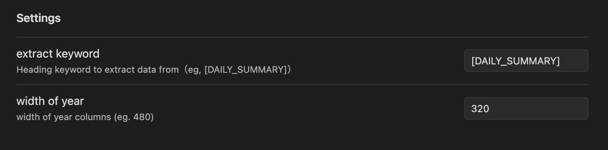
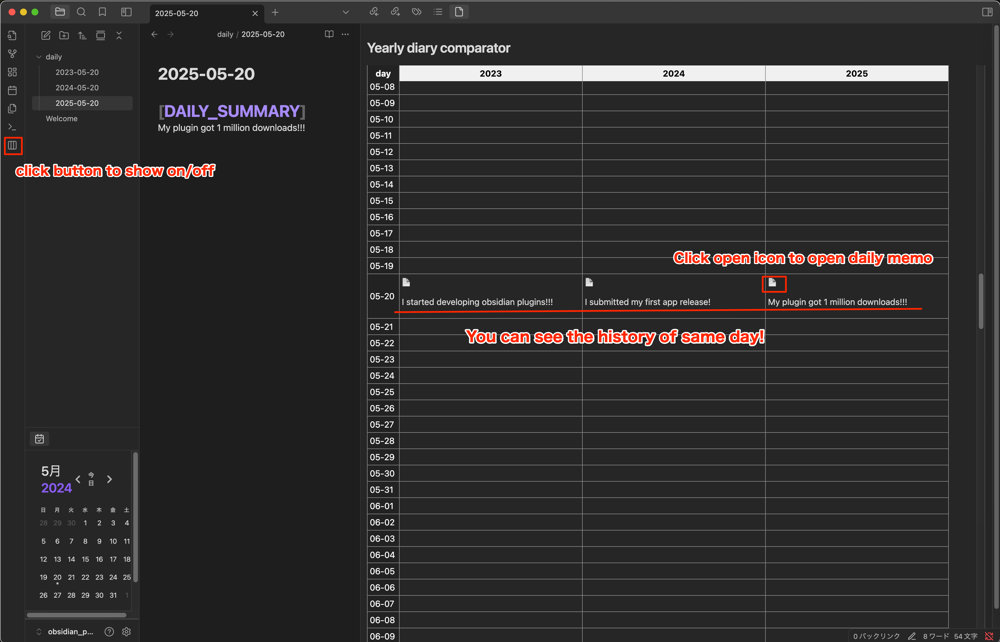

# Purpose

This plugin provides a yearly calendar view for Obsidian daily notes, allowing you to compare your activities or diary entries across different years. By displaying entries for the same date side by side, you can intuitively review changes and track your personal growth year over year.

# How to use

First, set a headline keyword to extract diary summaries from your daily notes.
The default keyword is [DAILY_SUMMARY].

And you can change the width of each columns of year.


eg.
```markdown
# [DAILY_SUMMARY]
My plugin got 1 million downloads!!!

```
After writing some content under the daily summary headline, simply click the icon in the ribbon to toggle the comparator view on or off.



